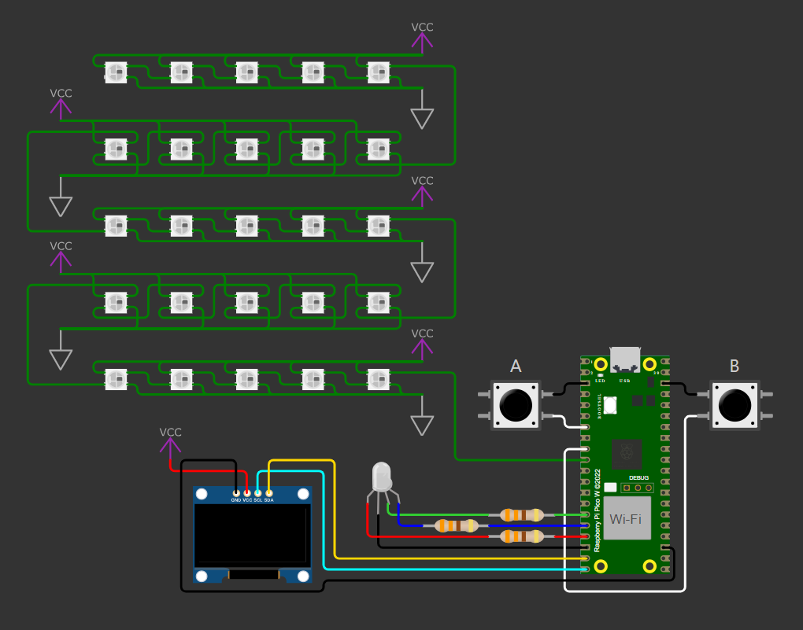
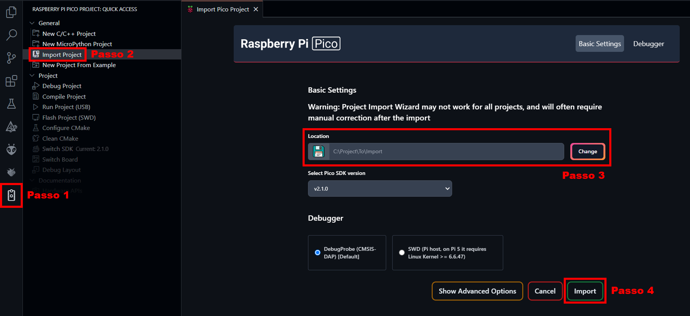
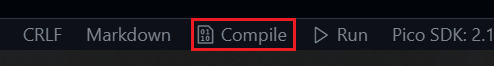
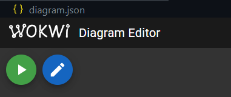

# Utilizando comunicação serial I2C e UART via USB para controlar um display OLED com o RP2040

## Sumário

1. [💡 O que é este projeto](#1--o-que-é-este-projeto)
2. [⚡ Diagrama do hardware](#2--diagrama-do-hardware)
3. [🎥 Vídeo demonstrativo](#3--vídeo-demonstrativo)
4. [🔎 Funcionalidades disponíveis](#4--funcionalidades-disponíveis)
5. [🧰 Pré-requisitos para executar](#5--pré-requisitos-para-executar)
6. [💻 Como executar a simulação](#6--como-executar-a-simulação)
7. [🐶 Como executar o código na placa BitDogLab](#7--como-executar-o-código-na-placa-bitdoglab)

## 1. 💡 O que é este projeto

Este é um firmware escrito em C que utiliza comunicação serial I2C e UART via USB para controlar um display OLED SSD1306 e uma matriz de LEDs WS2812 conectados a um Raspberry Pi Pico W. O projeto também permite que botões conectados à placa controlem um LED RGB adicional.

## 2. ⚡ Diagrama do hardware

O projeto utiliza os seguintes componentes de hardware:

- Matriz 5x5 de LEDs endereçáveis WS2812 (GPIO 7);
- LED RGB (GPIOs 11, 12 e 13);
- Botões A e B (GPIOs 5 e 6, respectivamente);
- Display SSD1306 (GPIOs 14 e 15 com protocolo I2C).

As conexões podem ser feitas de acordo com o esquema abaixo:

## 3. 🎥 Vídeo demonstrativo

Uma demonstração do projeto em funcionamento pode ser assistida no link abaixo:

...

## 4. 🔎 Funcionalidades disponíveis

O firmware controla todo o hardware visto no [tópico 2](#2--diagrama-do-hardware) e, por meio de interações do usuário, é capaz de:

1. exibir caracteres alfanuméricos **com letras maiúsculas e minúsculas** no display SSD1306, inseridos via monitor serial;

2. exibir simultaneamente os caracteres **numéricos** na matriz de LEDs WS2812, inseridos via monitor serial;

3. acender e apagar o canal verde do LED RGB ao pressionar o botão A;

4. acender e apagar o canal azul do LED RGB ao pressionar o botão B;

5. exibir mensagens informativas no display SSD1306 e no monitor serial **ao alterar o estado do LED com os botões A e B**;

## 5. 🧰 Pré-requisitos para executar

A configuração sugerida para executar o projeto é:

1. Ter o [Pico SDK](https://github.com/raspberrypi/pico-sdk) instalado na sua máquina;
2. Ter o [ARM GNU Toolchain](https://developer.arm.com/Tools%20and%20Software/GNU%20Toolchain) instalado na sua máquina;
3. Ter o [Visual Studio Code](https://code.visualstudio.com/download) instalado na sua máquina;
4. Ter este repositório clonado na sua máquina;
5. Ter as seguintes extensões instaladas no seu VS Code:
- [C/C++](https://marketplace.visualstudio.com/items?itemName=ms-vscode.cpptools);
- [CMake](https://marketplace.visualstudio.com/items?itemName=twxs.cmake);
- [CMake Tools](https://marketplace.visualstudio.com/items?itemName=ms-vscode.cmake-tools);
- [Raspberry Pi Pico](https://marketplace.visualstudio.com/items?itemName=raspberry-pi.raspberry-pi-pico);
- [Wokwi Simulator](https://marketplace.visualstudio.com/items?itemName=Wokwi.wokwi-vscode);
6. Ter uma placa BitDogLab disponível e pré configurada na sua máquina;

## 6. 💻 Como executar a simulação

Com os pré-requisitos atendidos, siga os passos a seguir:

1. Utilize o a extensão do Raspberry Pi Pico para VS Code para importar o projeto clonado:

2. Após carregar o SDK, clique em "Compile", à direita da barra de status e aguarde o processo:

3. Abra o arquivo `diagram.json` e clique no botão de play para iniciar a simulação:

4. Quando a simulação iniciar, teste o firmware conferindo se as especificações do [tópico 4](#4--funcionalidades-disponíveis) são atendidas. 

Para visualizar a implementação de recursos como o uso do monitor serial, recomenda-se seguir os passos do tópico abaixo para executar o firmware em uma placa BitDogLab.

## 7. 🐶 Como executar o código na placa BitDogLab

1. Execute a primeira instrução do tópico anterior e aguarde o carregamento do SDK;

2. Ligue a placa BitDogLab;

3. Pressione e segure o botão `BOOTSEL` no Raspberry Pi Pico W;

4. Pressione o botão `RESET` na BitDogLab;

5. Solte os botões dos passos 3 e 4;

6. Conecte a placa ao computador via USB;

7. Pressione o botão "Run" na barra inferior do VS Code.

Após a transferência, a placa reiniciará com o programa em execução.

Observação:

- Como alternativa ao passo 7, é possível transferir o arquivo `.uf2` presente na pasta `build` para o armazenamento da placa.
